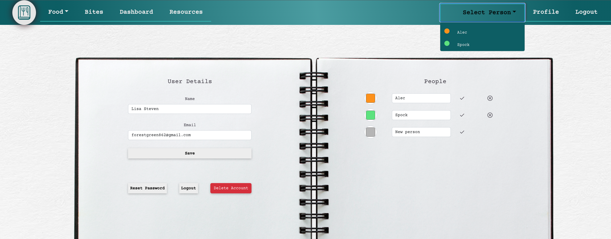
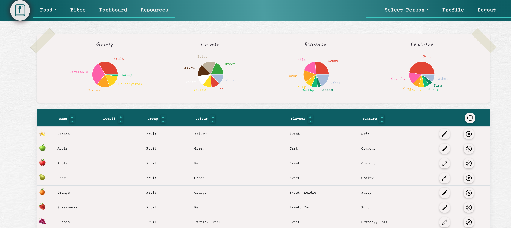
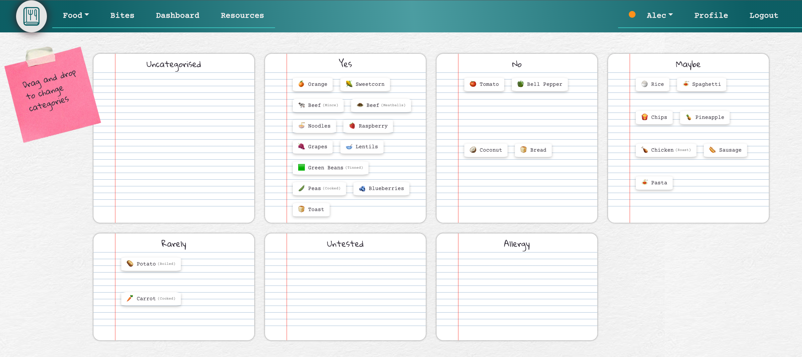
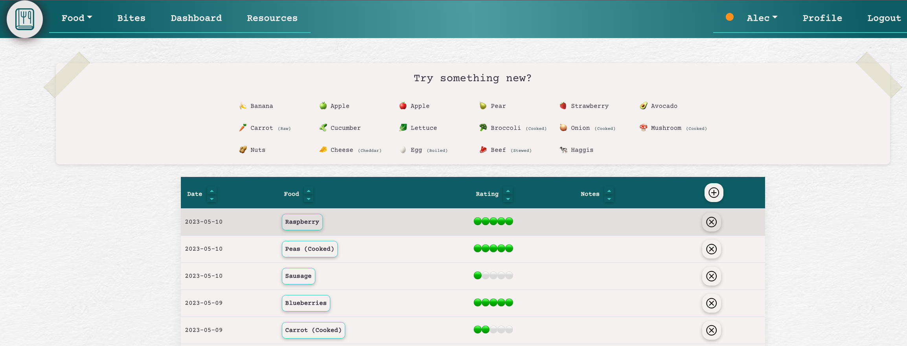
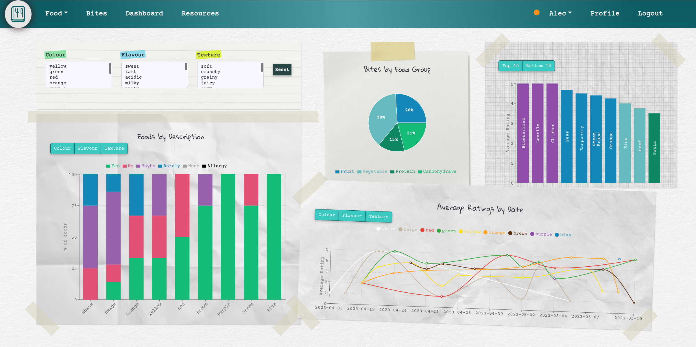
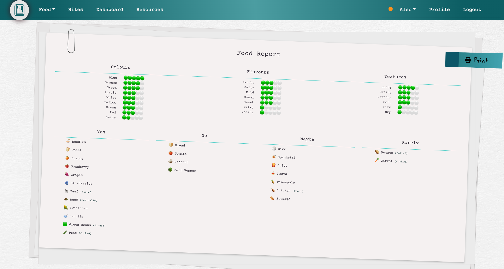

# BiteBook

A tracking app for food preferences.

BiteBook allows parents/carers for people with sensory issues to maintain a list of "safe" foods and to track changes in preference based on attributes such as colour, flavour, and texture.

&nbsp;

## Features

Click each item to see screenshots:

<details>
    <summary>Track data for multiple people</summary>
    
</details>
<details>
    <summary>Record food details such as colour, flavour, and texture</summary>
    
</details>
<details>
    <summary>Drag & drop to categorise foods based on preferences</summary>
    
</details>
<details>
    <summary>Record foods eaten and rate the reaction</summary>
    
</details>
<details>
    <summary>Track changes in preference using the dashboard</summary>
    
</details>
<details>
    <summary>Print a report to share with temporary carers, e.g. family or school</summary>
    
</details>

&nbsp;

## Technologies Used

- React (react-bootstrap, framer-motion, recharts)
- CSS (flexbox, grid, media queries)
- Firebase
- Redux
- Cypress
- Java (Spring Boot)
- JUnit5

&nbsp;

## Installation

1. Clone the repo

```
git clone https://github.com/LisaS7/bitebook.git
```

2. Run the Spring Boot server

```
cd server
java -jar target/bitebook-0.0.1-SNAPSHOT.jar
```

3. Install npm packages in client folder

```
cd ../client
npm install
```

4. Run the client server

```
npm start
```

5. Open http://localhost:3000/ in the browser
